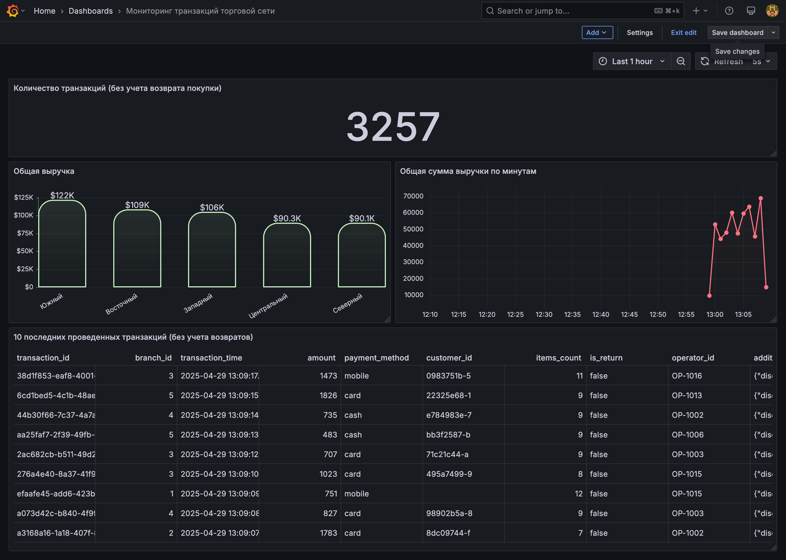

# kafka-spark-postgresql-grafana-streaming

## Preview

## Overview
This project is a fork of an existing original project. I remade it and now it's working for me.

The main idea of this project was to build a training infastructure which can be helpful in visualizing real-time generated data. I used the same stack as the origial author.

## Architecture
1. Kafka Producer - Generates and sends real-time messages to Kafka.
2. Kafka & Zookeeper - Kafka acts as a message broker, and Zookeeper manages the Kafka cluster.
3. Spark Structured Streaming - Consumes messages from Kafka, processes them, and writes to PostgreSQL.
4. PostgreSQL - Stores the processed streaming data.
5. Grafana - Connects to PostgreSQL and visualizes the live data.

Data Flow: Kafka Producer → Kafka Topic → Spark Streaming → PostgreSQL → Grafana Dashboard

## Project Setup

### Prerequisites
Ensure you have Docker, Docker Compose, Git, and Python installed.

### Clone the Repository
`git clone https://github.com/gndvrn/kafka-spark-postgres-grafana-streaming.git`

`cd kafka-spark-postgres-grafana-streaming`

### Start the Docker Containers
`docker-compose up --build -d`

This will up all the services needed in their docker containers.

### Verify the Setup
`docker ps`

Every container should be up. If not - check the `docker logs <container_name or container_id>`

## Project Components

### Producer
The producer generates real-time messages and sends them to Kafka.

You can change the data you want to generate. So, basically, you need to make changes in:

1. `producer/kafka_producer.py` - first of all, change the producer algoritm of data generation (you may also try to get data from external sources, such as weather data, crypto etc.)
2. `postgres/init/01-table.sql` - make sure you changed the database table structure for your needs;
3. `spark/kafka-spark-streaming.py` - the logic of an interaction with PostgreSQL also needs to be changed for new table structure;

### Kafka & Zookeeper
-

### Spark Structured Streaming
-

### PostgreSQL
You can manually connect to your PostgreSQL DB to check the table structure and data in it

Connect to the Database:  
`docker exec -it postgres psql -U postgres -d offline-store-transactions`

Then type in:  
`SELECT * FROM transactions ORDER BY transaction_time DESC LIMIT 10;`

This query will show you up the latest 10 transactions in your database.

### Grafana
1. Open Grafana: http://localhost:3000  
   - Username: admin  
   - Password: admin  

2. Add a PostgreSQL Data Source:  
   - URL: `postgres:5432`  
   - Database: `offline-store-transactions` 
   - User: `postgres`  
   - Password: `postgres`
   - Change SSL/TLS  value to `disable`
   - Scroll down and click `Test` (Database connection should be established at this moment)

3. Create a Dashboard for test:
   - Select Panel Type: Stat -> Table view  
   - Query: SELECT processed_at, message FROM kafka_messages ORDER BY processed_at DESC
   - Configure for your needs  
   - Click Save → Apply  

## Stopping the Services
`docker-compose down`
